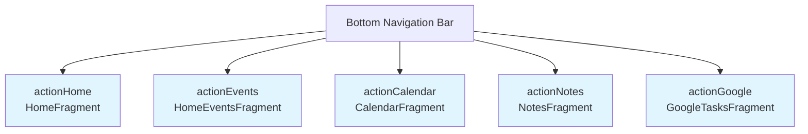
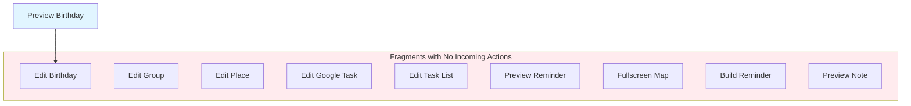
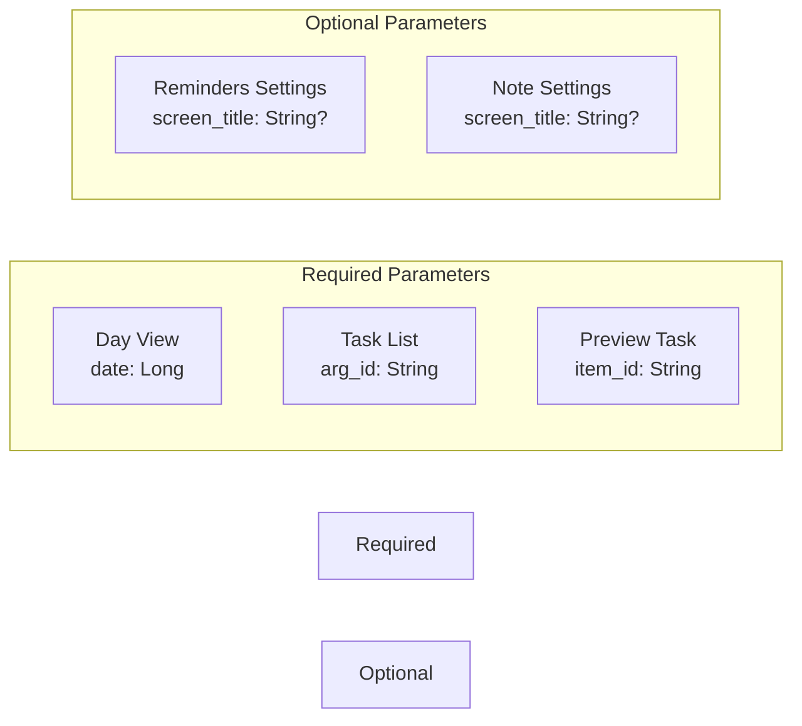
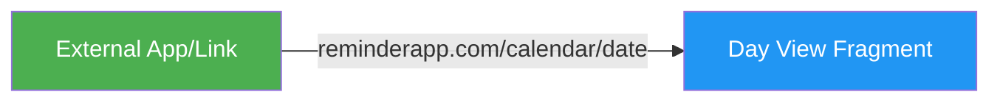
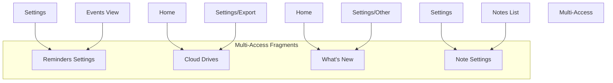
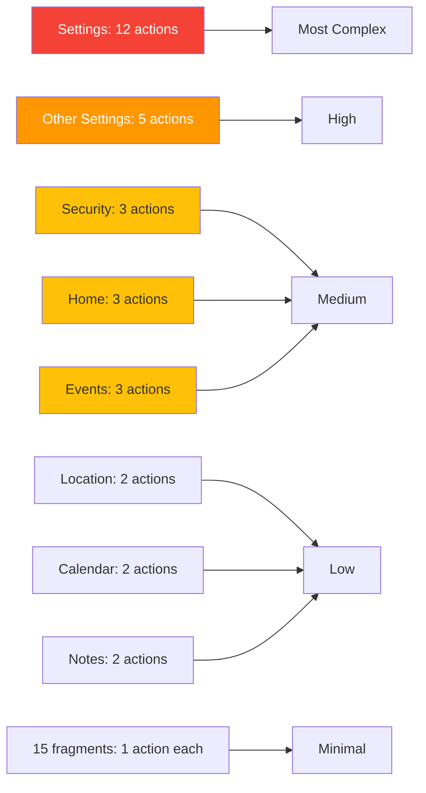
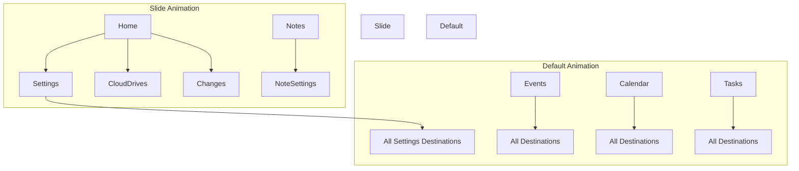
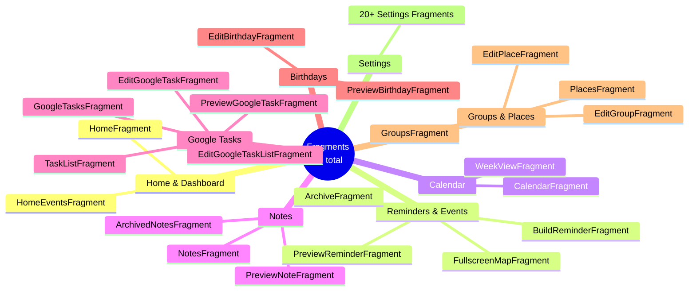

# Fragment Navigation Diagrams

This document contains visual diagrams of the fragment navigation graph using Mermaid syntax.

## Bottom Navigation Structure

## Complete Navigation Flow

```mermaid
graph TB
    %% Top Level
    Home[Home<br/>START]
    Events[Events View]
    Calendar[Calendar]
    Notes[Notes]
    Tasks[Google Tasks]

    %% Home Connections
    Home --> Settings[Settings Hub]
    Home --> CloudDrives1[Cloud Drives]
    Home --> Changes1[What's New]

    %% Settings Tree
    Settings --> General[General Settings]
    Settings --> Reminders[Reminders Settings<br/>param: screen_title?]
    Settings --> Export[Export Settings]
    Settings --> Notification[Notification Settings]
    Settings --> CalendarSettings[Calendar Settings]
    Settings --> Birthday[Birthday Settings]
    Settings --> Security[Security Settings]
    Settings --> Location[Location Settings]
    Settings --> Other[Other Settings]
    Settings --> NoteSettings1[Note Settings<br/>param: screen_title?]
    Settings --> Tests[Tests]
    Settings --> Pro[Pro Version]
    Settings --> Troubleshooting[Troubleshooting]

    General --> UIPreview[UI Preview]

    Reminders --> Presets[Manage Presets]

    Export --> CloudDrives2[Cloud Drives]

    CalendarSettings --> EventsImport[Events Import]

    Security --> AddPin[Add PIN]
    Security --> ChangePin[Change PIN]
    Security --> DisablePin[Disable PIN]

    Location --> MapStyle[Map Style]
    Location --> Places[Places]

    Other --> Permissions[Permissions]
    Other --> Changes2[What's New]
    Other --> OSS[Open Source Licenses]
    Other --> Privacy[Privacy Policy]
    Other --> Terms[Terms & Conditions]

    Tests --> ExportTest[Object Export Test]

    %% Events Connections
    Events --> Groups[Groups]
    Events --> Archive[Archive/Trash]
    Events --> Reminders2[Reminders Settings]
    Reminders2 --> Presets2[Manage Presets]

    %% Calendar Connections
    Calendar --> DayView[Day/Week View<br/>REQUIRED: date Long]
    Calendar --> CalendarSettings2[Calendar Settings]
    CalendarSettings2 --> EventsImport2[Events Import]

    %% Notes Connections
    Notes --> ArchivedNotes[Archived Notes]
    Notes --> NoteSettings2[Note Settings]

    %% Tasks Connections
    Tasks --> TaskList[Task List<br/>REQUIRED: arg_id String]
    TaskList --> PreviewTask[Preview Task<br/>REQUIRED: item_id String]

    %% Styling
    style Home fill:#4CAF50,color:#fff
    style Events fill:#2196F3,color:#fff
    style Calendar fill:#FF9800,color:#fff
    style Notes fill:#9C27B0,color:#fff
    style Tasks fill:#F44336,color:#fff
    style Settings fill:#FFC107
    style DayView fill:#ffebee
    style TaskList fill:#ffebee
    style PreviewTask fill:#ffebee
```

## Settings Section Detailed

```mermaid
graph TB
    Settings[Settings Hub<br/>12 destinations]

    Settings --> Gen[General Settings]
    Settings --> Rem[Reminders Settings]
    Settings --> Exp[Export Settings]
    Settings --> Not[Notification Settings]
    Settings --> Cal[Calendar Settings]
    Settings --> Bir[Birthday Settings]
    Settings --> Sec[Security Settings]
    Settings --> Loc[Location Settings]
    Settings --> Oth[Other Settings]
    Settings --> Note[Note Settings]
    Settings --> Test[Tests]
    Settings --> Pro[Pro Version]
    Settings --> Trbl[Troubleshooting]

    Gen --> UI[UI Preview]

    Rem --> Pre[Manage Presets]

    Exp --> Cld[Cloud Drives]

    Cal --> Imp[Events Import]

    Sec --> Add[Add PIN]
    Sec --> Chg[Change PIN]
    Sec --> Dis[Disable PIN]

    Loc --> Map[Map Style]
    Loc --> Plc[Places]

    Oth --> Perm[Permissions]
    Oth --> Chng[What's New]
    Oth --> OSS[OSS Licenses]
    Oth --> Priv[Privacy Policy]
    Oth --> Term[Terms]

    Test --> ObjTest[Object Export Test]

    style Settings fill:#FFC107
    style Sec fill:#f44336,color:#fff
    style Oth fill:#9C27B0,color:#fff
```

## Orphan Fragments (No Incoming Actions)

These fragments are defined in the navigation graph but have no explicit navigation actions pointing to them. They are likely invoked programmatically (e.g., from FAB buttons, list item clicks):

## Parameter Requirements

## Deep Links

## Fragment Access Patterns

## Navigation Complexity Score

Fragments ranked by number of outgoing navigation actions:

## Animation Schemes

## Fragment Categories

---

## How to View These Diagrams

These diagrams are written in Mermaid syntax. You can view them in:

1. **GitHub** - Automatically renders Mermaid diagrams
2. **VS Code** - Install "Markdown Preview Mermaid Support" extension
3. **JetBrains IDEs** - Built-in Mermaid support in Markdown preview
4. **Online** - https://mermaid.live/

---

## Legend

- **Blue Boxes** - Top-level navigation fragments (bottom nav)
- **Green Boxes** - Entry points
- **Red Boxes** - High complexity (many connections)
- **Orange Boxes** - Medium complexity
- **Yellow Boxes** - Low complexity
- **Pink/Light Red Boxes** - Require parameters
- **Light Yellow Boxes** - Optional parameters
- **Light Green Boxes** - Multi-access fragments

---

**Generated:** 2025-11-02
**Source:** `app/src/main/res/navigation/home_nav.xml`

